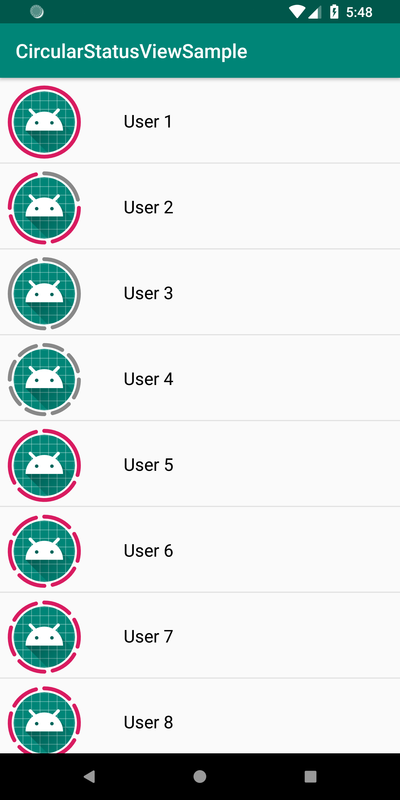
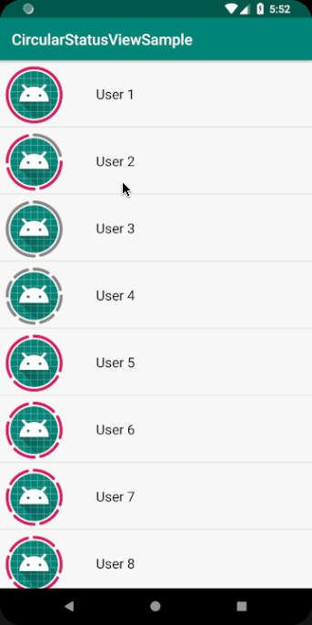

# CircularStatusView
A Simple View that will draw portions of a Circle depending on a number , just like WhatsApp


## Demo
<p float="left">
   
  
</p>


## Install
```gradle
dependencies {
  implementation 'com.devlomi:circularstatusview:1.0.0'
}
```


## Usage
NOTE:you can replace `CircleImageView` with any view 

### XML

```xml

 <?xml version="1.0" encoding="utf-8"?>
  <RelativeLayout
        android:id="@+id/image_layout"
        android:layout_width="wrap_content"
        android:layout_height="wrap_content"
        android:layout_marginLeft="8dp"
        android:layout_marginTop="8dp"
        app:layout_constraintLeft_toLeftOf="parent"
        app:layout_constraintTop_toTopOf="parent">


        <de.hdodenhof.circleimageview.CircleImageView
            android:layout_width="75dp"
            android:layout_height="75dp"
            android:layout_centerInParent="true"
            android:padding="6dp"
            android:src="@mipmap/ic_launcher" />

        <com.devlomi.circularstatusview.CircularStatusView
            android:id="@+id/circular_status_view"
            android:layout_width="75dp"
            android:layout_height="75dp"
            android:layout_centerInParent="true"
            app:portion_color="@color/colorAccent"
            app:portion_spacing="4dp"
            app:portion_width="4dp"
            app:portions_count="8" />


    </RelativeLayout>

```


### Java

### Basic Usage
```java

        CircularStatusView circularStatusView = findViewById(R.id.record_view);
        circularStatusView.setPortionsCount(statusList.size());
        circularStatusView.setPortionsColor(getResources().getColor(R.color.colorAccent););

```

### Advanced Usage

```java
            if (userStatus.areAllSeen()) {
                //set all portions color
                circularStatusView.setPortionsColor(seenColor);
            } else {
                for (int i = 0; i < statusList.size(); i++) {
                    Status status = statusList.get(i);
                    int color = status.isSeen() ? seenColor : notSeenColor;
                    //set specific color for every portion
                    circularStatusView.setPortionColorForIndex(i, color);
                }

            }
```

for more info please check the sample app

### Customization

```java
            circularStatusView.setPortionSpacing(5);//set the spacing between portions
            circularStatusView.setPortionWidth(10);//set portion width
            circularStatusView.setCustomPaint(myPaint); //create your custom paint for portions
```

```
   Copyright 2018 AbdulAlim Rajjoub

   Licensed under the Apache License, Version 2.0 (the "License");
   you may not use this file except in compliance with the License.
   You may obtain a copy of the License at

       http://www.apache.org/licenses/LICENSE-2.0

   Unless required by applicable law or agreed to in writing, software
   distributed under the License is distributed on an "AS IS" BASIS,
   WITHOUT WARRANTIES OR CONDITIONS OF ANY KIND, either express or implied.
   See the License for the specific language governing permissions and
   limitations under the License.
```

